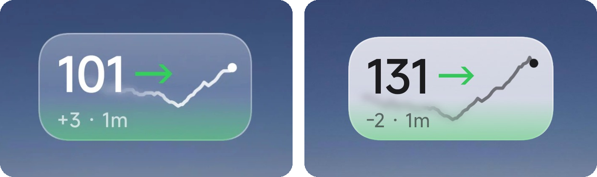
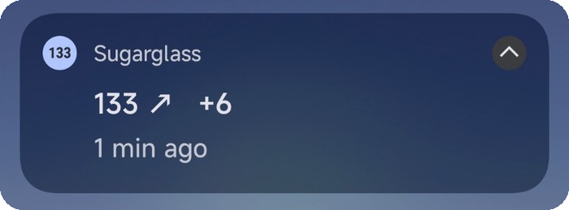
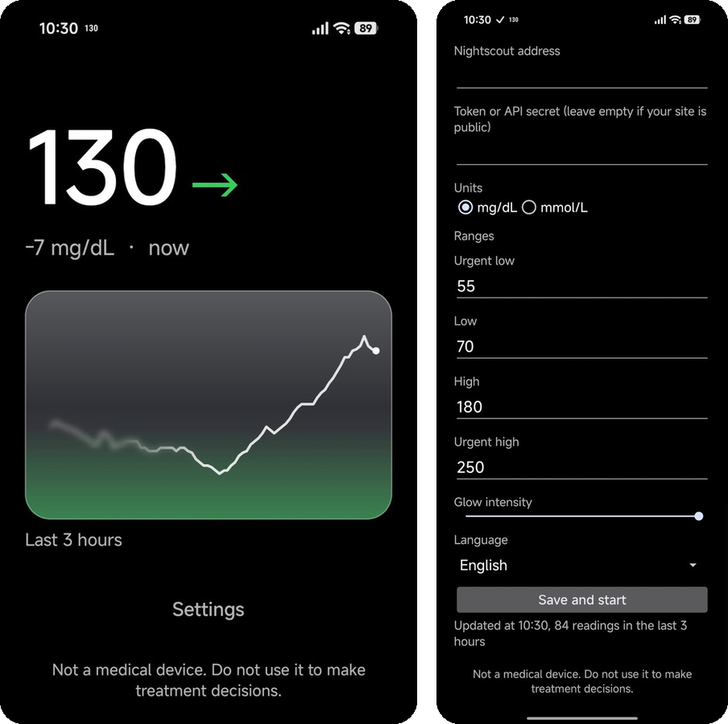

# Sugarglass

A tiny Android app that shows your glucose from **Nightscout** as a glass-style home screen widget, a persistent notification and a number in the status bar. Nothing else.

<p align="center">
  
</p>

<h3 align="center"><a href="https://github.com/federicomameli1/sugarglass/releases/latest/download/sugarglass.apk">⬇ Download Sugarglass for Android</a></h3>
<p align="center">Latest version, about 40 KB. Open this page on your phone and tap the link. <a href="#install">How to install</a></p>

## What it does

- **Widget, any size.** 1x1 shows the value; 2x1 and wider add the last 3 hours as a line, blurred where it passes behind the number and arrow. A soft glow from the bottom turns green, yellow or red with your range.
- **Readable graph.** Faint dashed lines mark your target range (you can hide them), and the scale either fits your data or stays fixed at a range you choose.
- **Persistent notification** with value, trend arrow, 5-minute delta and age.
- **Status bar number**, so you see your glucose without pulling the shade down.
- **mg/dL or mmol/L**, and your own urgent low / low / high / urgent high ranges.
- **Light and dark**: follows the system, or pick one for the widget. On Android 12+ the glass picks up your wallpaper colours (Material You).
- **Adjustable glow**, from off to vivid.
- **In English, Italiano, Français, Deutsch, Español, Português, Nederlands and Polski**, following the system or picked in the settings. Translation fixes are very welcome.

What it deliberately does **not** do: alarms, treatments, uploading, statistics. Use your CGM app or xDrip+/AAPS for those. Sugarglass only reads.

## Notification and app

<p align="center">
  
</p>
<p align="center">
  
</p>

## Install

1. On your phone, [download the APK](https://github.com/federicomameli1/sugarglass/releases/latest/download/sugarglass.apk) and open it. Android will ask you to **allow installing apps** from your browser or file manager the first time: allow it, then tap **Install**. If Google Play Protect warns that the app comes from an unknown developer, that is because it isn't on the Play Store: tap **More details → Install anyway**. Updates install the same way, over the old version, and keep your settings.
2. Open Sugarglass, enter your Nightscout address and, if your site is not public, a token (recommended, with the `readable` role) or your API secret. Tap **Save and start**. A Nightscout on your home network (`http://192.168.…`) works too.
3. Allow notifications and let it **ignore battery optimisation**: without that Android may stop it.
4. Long-press the home screen and add the Sugarglass widget.

### If the widget stops updating

Some phones close background apps even after step 3. Menu names change between versions, so look for the closest match:

- **Xiaomi, Redmi, POCO (HyperOS):** long-press the app icon → App info → turn on **Autostart**, and under **Battery saver** choose **No restrictions**. Then open the recent apps, long-press Sugarglass and **lock** it.
- **Samsung (One UI):** Settings → Apps → Sugarglass → Battery → **Unrestricted**. Also Settings → Battery → Background usage limits: make sure Sugarglass isn't under sleeping apps.
- **OnePlus, Oppo, Realme (ColorOS, OxygenOS):** App info → Battery usage → allow **background activity** and **auto launch**.
- **Pixel and most other phones:** step 3 is enough.

Tested on HyperOS only so far; if the steps for your phone differ, please open an issue. For other brands, [dontkillmyapp.com](https://dontkillmyapp.com) is older but still has pointers.

## Privacy

Sugarglass talks to your Nightscout site and nothing else. Your address and token stay on your phone. No analytics, no ads, no account.

Permissions: internet (Nightscout), notifications, foreground service (to stay alive), start at boot, and the request to be excluded from battery optimisation.

## Not a medical device

Sugarglass is a hobby project and is not a medical device. It can show old, wrong or missing data. **Do not use it to make treatment decisions**; always check your CGM app or a meter.

## Build

JDK 17 and the Android SDK (platform 34).

```
./gradlew test assembleDebug
```

The debug build installs next to the real app as **Sugarglass debug**, and its settings have a Debug page with fake readings: pick any value, trend or a stale reading and see the widget, notification and status bar with it. A prebuilt one is attached to each release.

Release builds are signed with a key kept outside the repo: create `keystore.properties` in the project root with `storeFile`, `storePassword`, `keyAlias` and `keyPassword`, then `./gradlew assembleRelease`.

## License

MIT
